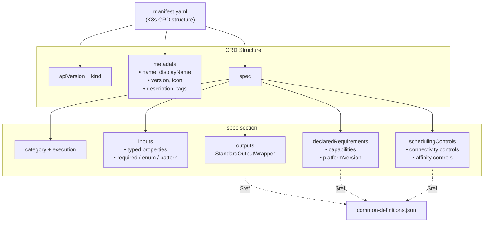
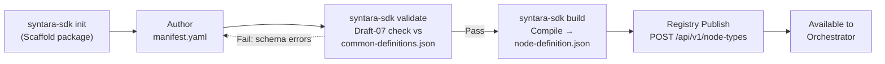
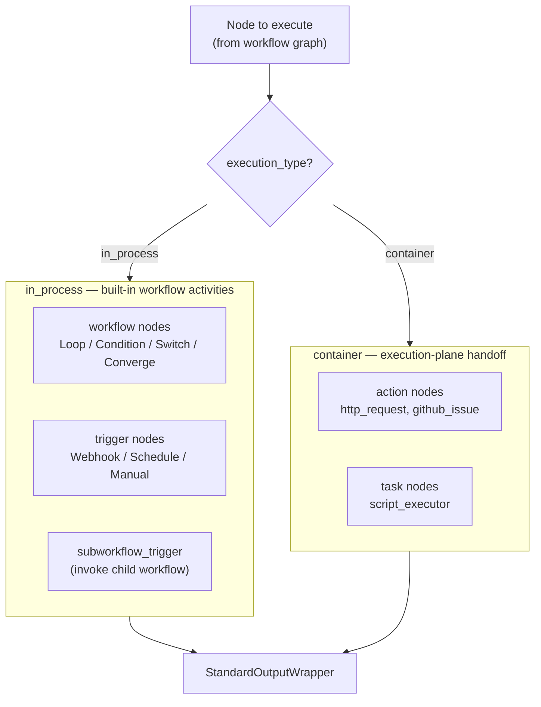
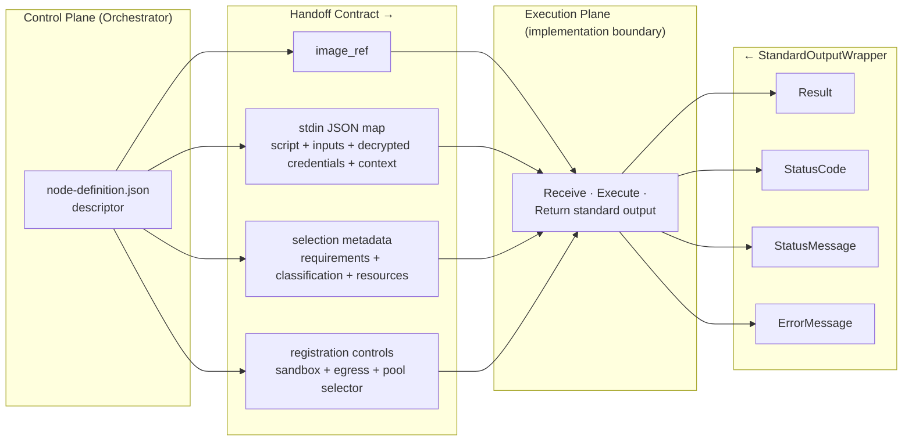
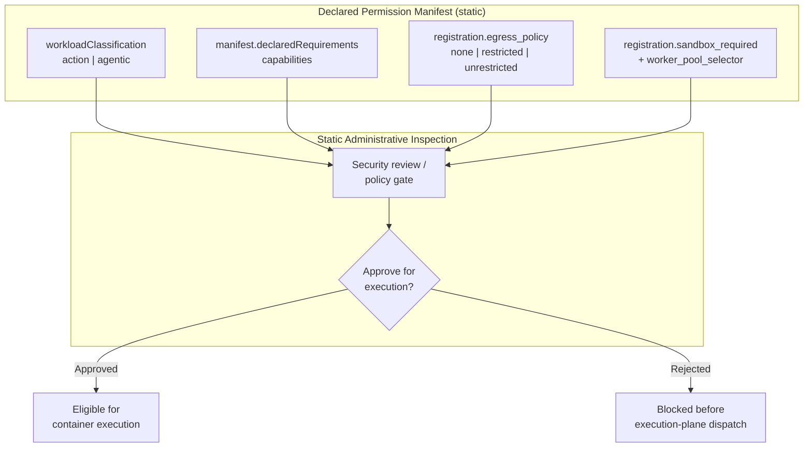

# Syntara Node SDK Architecture

The Syntara Node SDK is a schema-driven framework for authoring, packaging, and registering custom automation nodes. This document defines the node taxonomy, authoring format, registry database schema, REST API contract, and dynamic dispatch logic.

## Architecture Principles and Boundaries

The following principles are normative for the SDK-owned contracts. The SDK owns schemas, manifests, compiled descriptors, declared requirements, registration metadata, and the abstract task-invocation payload. The execution plane owns worker lifecycle, provisioning backends, pool image selection, runtime credential injection, sandbox transport, retries, persistence, scrubbing implementation, and completion delivery. Later sections provide implementation details and examples without redefining these boundaries.

1. **YAML authoring, JSON registry.** Developers author `manifest.yaml` in a human-friendly format with comments. The SDK validates it against JSON Schema Draft-07 and compiles it to `node-definition.json`; registry authority then follows the node-type registration paths described below.

2. **Four-category taxonomy.** Every node declares exactly one of `action`, `task`, `workflow`, or `trigger`. The category, together with `execution_type`, determines routing and validation.

3. **Explicit execution boundary and abstract task payload.** Every node declares `execution_type` as `in_process` or `container`. In-process nodes run as built-in workflow activities; container nodes are handed to the execution plane with their descriptor, selection metadata, registration controls, and abstract task invocation. The container invocation is one JSON map containing `script`, plain `inputs`, decrypted `credentials`, and `workflow_context` over `stdin`; the node returns JSON over `stdout`. The separate `credentials` map exists because the compiled schema identifies sensitive input values. The execution plane owns the concrete transport, injection, lifecycle, retries, persistence, and completion behavior.

4. **Metadata remains coupled to a container artifact.** Fully decoupling metadata is rejected because independently versioned metadata can drift from the image. A container-backed node stores its manifest as an OCI-compliant referral layer annotation with media type `application/vnd.syntara.node.manifest.v1+yaml`. Registration issues an OCI Distribution API v2 manifest request such as `GET /v2/<name>/manifests/<tag>` (or the digest-resolved equivalent), inspects the response headers/referral annotations in `<10 ms`, and does not download image layers. The extracted manifest hydrates PostgreSQL `node_types` fields `descriptor`, `inputs`, `outputs`, `execution_type`, and `image_ref`. The React canvas reads `GET /api/v1/node-types` locally and renders fields in `<500 ms` without an edit-time OCI request.

5. **Selection metadata is part of the SDK-to-plane handoff.** `declaredRequirements`, `schedulingControls`, `workloadClassification`, resource requirements, and execution timeout describe what the node needs so the platform can validate and route it. These fields express node needs; they do not define worker lifecycle or runtime enforcement mechanics.

6. **Secret handling has an ordered SDK handoff lifecycle.** Draft-07 input properties must use `secret: true` for sensitive values; `is_secret: true` is the compatibility alias. The SDK-side order is `classify → split → decrypt → construct stdin`: secret-marked values are removed from plain `inputs`, decrypted into the transient `credentials` map, and included in the single stdin envelope. The same schema flags remain available to the execution plane for credential separation and its logging and persistence guarantees.

7. **Requirements and controls have different owners.** Developer manifests may declare requested capabilities in `spec.declaredRequirements` (for example, `capabilities: [network-egress]`). Syntara administrators set the effective infrastructure controls at registration through `sandbox_required`, `egress_policy`, and `worker_pool_selector`; these settings are not hardcoded in developer metadata. The API includes those fields so pools can be provisioned automatically or assigned manually without changing the SDK contract.

8. **Registration authority follows the node description.** In-process platform nodes and shared-runner script nodes accept client-supplied `descriptor` values through `POST/PATCH`. Dedicated container extensions accept `image_ref`; the platform derives `descriptor` from the OCI referral layer, disables direct descriptor patches, and requires a new image tag or digest for descriptor changes.

9. **Strict backwards compatibility.** `StandardOutputWrapper` (`Result`, `StatusCode`, `StatusMessage`, `ErrorMessage`) is immutable. Template expressions like `${task.Result.stdout}` never break across node versions.

10. **Zero-trust resources.** Node definitions store only UUID references to platform-managed credentials. Runtime secret handling and the persistence/logging guarantee are execution-plane responsibilities, while the SDK preserves the credential-reference and sensitive-input contracts described above and in **Credential Handling**.

## Core Architectural Standards & Taxonomy

### Node Category Taxonomy

The platform recognizes exactly four categories, defined canonically as `NodeCategory` in `common-definitions.json`:

```json
"enum": ["action", "task", "workflow", "trigger"]
```

| Category | Purpose | Typical `execution_type` | Examples |
|----------|---------|--------------------------|----------|
| `action` | Domain and external API integrations | `container` | `http_request`, `github_issue` |
| `task` | Atomic compute and script executors | `container` | `script_executor` (Python 3.12, Bash 5.2) |
| `workflow` | In-memory control-plane logic | `in_process` | `condition`, `loop`, `switch` |
| `trigger` | Event entry points | `in_process` | Webhook, Schedule, Manual, `subworkflow_trigger` |

### Execution Type

`NodeExecutionType` (`common-definitions.json`) captures *where* a node runs:

```json
"enum": ["in_process", "container"]
```

- **`in_process`** — executed inline as a built-in workflow activity inside the orchestrator process. Reserved for control-plane `workflow` logic and `trigger` nodes that need no isolated runtime.
- **`container`** — handed to the execution plane with the node's descriptor, selection metadata, registration controls, and abstract task invocation. The SDK does not prescribe the execution plane's worker lifecycle, provisioning backend, transport, or runtime isolation implementation.

### The `subworkflow_trigger` Node

`subworkflow_trigger` is a dedicated, first-class node type that lets a parent workflow invoke a child workflow as a composable, reusable unit.

- **Category:** `trigger`
- **Execution type:** `in_process`
- **Reference implementation:** [nodes/subworkflow-trigger/](../nodes/subworkflow-trigger/)

It runs in-process: it accepts the **parent workflow context**, an **ingress payload schema** (the parent↔child contract), and the **caller execution ID**, then hands control to the referenced child workflow. It returns a `StandardOutputWrapper` whose `Result` carries the child workflow's terminal output, so downstream parent nodes can reference it via stable template expressions (e.g., `${call_child.Result.summary}`).

### `manifest.yaml` — The Developer Authoring Format

Developers author a single `manifest.yaml` following Kubernetes Custom Resource Definition (CRD) conventions. The manifest is:

- **Human-friendly** — supports comments and multi-line strings
- **K8s-style structure** — uses `apiVersion`, `kind`, `metadata`, and `spec` sections
- **Validated** — checked against JSON Schema (Draft-07) referencing `common-definitions.json`
- **Compiled** — `syntara-sdk build` produces `node-definition.json`, the artifact stored in the registry

For dedicated container extensions, the manifest remains coupled to the container artifact through the OCI referral layer. In-process platform nodes and shared-runner script nodes use the direct descriptor registration path. In both cases, the canvas consumes the local registry record rather than fetching remote metadata while an editor is open.

**Standard Package Layout:**
```
my-custom-node/
├── manifest.yaml              # Primary authoring manifest (YAML, K8s CRD structure)
├── main.py                    # Imperative execution code (or main.sh for Bash)
├── requirements.txt           # Python dependencies (optional)
├── README.md                  # Node documentation
└── tests/
    └── test_main.py           # Unit tests
```

**Example `manifest.yaml` structure (K8s CRD style):**

The base manifest includes `spec.declaredRequirements`. Extension authors use it to declare requested capabilities, credential types, and minimum platform version. These declarations are inputs to administrative review; they do not themselves grant sandbox, network, or worker-pool access.

```yaml
apiVersion: syntara.io/v1alpha1
kind: NodeType

metadata:
  name: http_request
  displayName: HTTP Request
  version: 1.0.0
  icon: globe
  description: |
    Non-blocking HTTP/HTTPS API orchestrator with credential injection,
    response parsing, and automatic retry logic.
  tags:
    - integration:rest-api
    - network:external
  author: Syntara Team
  license: Apache-2.0

spec:
  category: action
  execution:
    type: container
    image: registry.example.com/nodes/http-request:1.0.0

  declaredRequirements:
    capabilities:
      - network-egress
      - readonly-root-filesystem
      - tmpfs-mount
    platformVersion: ">=3.0.0"

  schedulingControls:
    # Optional developer-declared controls. Effective sandbox, egress, and
    # worker-pool policy is supplied by administrators at registration.
    connectivity_requirements:
      - host: api.github.com
        ports:
          - port: 443
            protocol: TCP

  inputs:
    properties:
      url:
        type: string
        description: Target HTTP/HTTPS URL
      api_key:
        type: string
        description: Runtime API key; classified as sensitive by the schema
        secret: true
      method:
        type: string
        enum: [GET, POST, PUT, DELETE, PATCH]
        default: GET
    required:
      - url
      - method

  outputs:
    allOf:
      - $ref: "../common-definitions.json#/definitions/StandardOutputWrapper"

  resourceRequirements:
    limits:
      cpu: 500m
      memory: 256Mi
    requests:
      cpu: 100m
      memory: 128Mi

  executionTimeout: 60
```

### Diagram 1 — Node Definition Composition (`manifest.yaml`)

Structural breakdown of what a `manifest.yaml` composes.



### Diagram 2 — SDK Authoring & Packaging Lifecycle

The developer lifecycle from scaffold to registry handoff.



## Database Schema & Registry API

The registry persists compiled node definitions in PostgreSQL and exposes them through a versioned REST API.

### `node_types` Table (DDL)

```sql
CREATE TABLE node_types (
    id             UUID PRIMARY KEY DEFAULT gen_random_uuid(),
    name           TEXT NOT NULL,
    category       TEXT NOT NULL
                     CHECK (category IN ('action', 'task', 'workflow', 'trigger')),
    execution_type TEXT NOT NULL
                     CHECK (execution_type IN ('in_process', 'container')),
    descriptor     JSONB NOT NULL,          -- compiled node-definition.json
    inputs         JSONB NOT NULL,          -- hydrated input schema projection
    outputs        JSONB NOT NULL,          -- hydrated output schema projection
    image_ref      TEXT,                     -- container image (NULL for in_process nodes)
    sandbox_required BOOLEAN NOT NULL DEFAULT TRUE,
    egress_policy  TEXT NOT NULL DEFAULT 'restricted'
                     CHECK (egress_policy IN ('none', 'restricted', 'unrestricted')),
    worker_pool_selector JSONB NOT NULL DEFAULT '{}'::jsonb,
    version        TEXT NOT NULL DEFAULT '1.0.0',
    enabled        BOOLEAN NOT NULL DEFAULT TRUE,
    created_at     TIMESTAMPTZ NOT NULL DEFAULT now(),
    updated_at     TIMESTAMPTZ NOT NULL DEFAULT now(),
    UNIQUE (name, version)
);

-- Container-backed nodes must declare an image; in_process nodes must not.
ALTER TABLE node_types ADD CONSTRAINT node_types_image_ref_by_execution_type
    CHECK (
        (execution_type = 'container'  AND image_ref IS NOT NULL) OR
        (execution_type = 'in_process' AND image_ref IS NULL)
    );

-- GIN index for querying declared capabilities / connectivity inside the descriptor.
CREATE INDEX idx_node_types_descriptor ON node_types USING GIN (descriptor);
CREATE INDEX idx_node_types_category   ON node_types (category);
CREATE INDEX idx_node_types_enabled    ON node_types (enabled);
```

### Registry ORM and API mapping

The DDL above is the authoritative persistence contract. A backend may map the table to SQLModel, SQLAlchemy, Pydantic, or another ORM/API model; no particular Python class is normative.

`NodeTypeDescriptor` is the implementation/API name for a `node_types` registry record. It is not the compiled descriptor itself. The `descriptor` JSONB field stores the compiled `node-definition.json`, while `inputs` and `outputs` store the hydrated projections used by the canvas and execution plane.

| Mapping group | Fields | Required invariants |
|---|---|---|
| Identity | `id`, `name`, `version` | UUID primary key; `(name, version)` is unique; version defaults to `1.0.0` |
| Classification | `category`, `execution_type` | Category is `action`, `task`, `workflow`, or `trigger`; execution type is `in_process` or `container` |
| Definition | `descriptor`, `inputs`, `outputs` | All are non-null JSONB; descriptor authority follows the node's registration path |
| Runtime | `image_ref` | Required for `container`; must be null for `in_process` |
| Administrative policy | `sandbox_required`, `egress_policy`, `worker_pool_selector` | Non-null policy fields; egress is `none`, `restricted`, or `unrestricted`; selector defaults to `{}` |
| State and audit | `enabled`, `created_at`, `updated_at` | Non-null state and timestamps with database defaults |

### Registry REST API — `/api/v1/node-types`

All responses use a standard envelope. Single-resource responses wrap the record; list responses include pagination metadata.

| Method | Path | Purpose |
|--------|------|---------|
| `POST` | `/api/v1/node-types` | Register a node using its authoritative registration path |
| `GET` | `/api/v1/node-types` | List registered node types (filter by `category`, `execution_type`, `enabled`; `?view=palette` for the visual-builder drawer) |
| `GET` | `/api/v1/node-types/{id}` | Fetch a single node type record (the path also accepts a node `name`, resolving to the latest version) |
| `GET` | `/api/v1/node-types/{id}/descriptor` | Fetch the raw compiled `node-definition.json` (unwrapped) for canvas form rendering |
| `PATCH` | `/api/v1/node-types/{id}` | Update permitted fields; direct descriptor updates are supported for in-process platform nodes and shared-runner script nodes only |
| `DELETE` | `/api/v1/node-types/{id}` | Remove a node type from the registry |

**`POST /api/v1/node-types`** — request-body authority:

Registration accepts the authoritative metadata for the node's registration path and the administrative policy that Syntara applies to the registered node. The policy is deliberately not stored in the developer manifest or OCI referral layer. `worker_pool_selector` contains affinity labels used to select an existing pool; the platform may provision a matching pool automatically or operations may assign one manually.

The client-supplied `descriptor` rule is explicit: in-process platform nodes and shared-runner script nodes submit `descriptor` directly; dedicated container extensions submit `image_ref` and must omit `descriptor`. For dedicated container extensions, the registry derives the authoritative descriptor from the OCI referral layer and returns that derived descriptor in the registration response.

### Authoritative registration paths by node type

The registration source of truth depends on whether the node is a platform-owned definition, a zero-build script definition, or a dedicated extension image:

| Node type | Authoritative registration path | Image and descriptor rules |
|-----------|--------------------------------|----------------------------|
| In-process platform nodes | Submit the compiled `descriptor` directly through `POST /api/v1/node-types`; update it through `PATCH /api/v1/node-types/{id}` | The descriptor is authoritative. These nodes have `execution_type: in_process` and no container image or OCI referral layer. |
| Script nodes using the shared platform runner | Submit the compiled `descriptor` directly through `POST /api/v1/node-types`; update it through `PATCH /api/v1/node-types/{id}` | The descriptor is authoritative. A node may reference a platform-managed shared script-runner image, but the node does not ship a dedicated OCI image or referral layer. |
| Dedicated container extensions | Submit `image_ref` through `POST /api/v1/node-types`; the platform queries OCI manifest/digest headers in `<10 ms`, extracts the embedded manifest annotation, and hydrates PostgreSQL | The OCI artifact and its embedded manifest are authoritative. Direct descriptor patches are disabled. A descriptor change requires registering a new container image tag or digest. |

For dedicated container extensions, `image_ref` identifies the artifact whose metadata is inspected. Re-registering a new image version or digest is the supported descriptor-update path and prevents image/metadata version drift.

Direct database `PATCH` of a dedicated container extension's descriptor is disabled. Descriptor changes for dedicated container extensions must go through image registration so the OCI artifact, embedded manifest, image tag/digest, and PostgreSQL record remain aligned.

For in-process platform nodes and shared-runner script nodes, direct descriptor submission is the standard production path because these nodes are platform-owned or zero-build definitions. The registry stores their manifests directly, without requiring a dedicated extension OCI image layer. Administrative fields remain registration-owned for every node type.

```json
{
  "name": "script_executor",
  "category": "task",
  "execution_type": "container",
  "image_ref": "registry.example.com/nodes/script-executor:1.0.0",
  "version": "1.0.0",
  "sandbox_required": true,
  "egress_policy": "restricted",
  "worker_pool_selector": {
    "workload": "automation",
    "region": "us-east-1"
  }
}
```

The registration payload validates `sandbox_required` as a boolean, `egress_policy` as one of `none`, `restricted`, or `unrestricted`, and `worker_pool_selector` as an affinity-label map. These fields keep the prototype independent of the eventual pool-provisioning strategy: worker pools may be created on extension registration or assigned later by operations without changing the SDK contract.

For in-process platform nodes and shared-runner script nodes, the direct descriptor path is authoritative:

```json
{
  "name": "script_executor",
  "category": "task",
  "execution_type": "container",
  "image_ref": "registry.syntara.io/platform/script-runner:1.0.0",
  "version": "1.0.0",
  "descriptor": { "...": "compiled node-definition.json" },
  "sandbox_required": true,
  "egress_policy": "restricted",
  "worker_pool_selector": {
    "workload": "automation"
  }
}
```

For in-process platform nodes, `execution_type` is `in_process` and `image_ref` is omitted. For shared-runner script nodes, `image_ref`, when present, identifies the shared platform script runner rather than a node-owned OCI artifact.

The `descriptor` shown in the following `201 Created` response is the registry's stored result: it is derived from OCI for dedicated container extensions and echoes the client-supplied descriptor for in-process platform nodes or shared-runner script nodes.

Response `201 Created`:

```json
{
  "data": {
    "id": "550e8400-e29b-41d4-a716-446655440000",
    "name": "script_executor",
    "category": "task",
    "execution_type": "container",
    "image_ref": "registry.example.com/nodes/script-executor:1.0.0",
    "version": "1.0.0",
    "sandbox_required": true,
    "egress_policy": "restricted",
    "worker_pool_selector": {
      "workload": "automation",
      "region": "us-east-1"
    },
    "enabled": true,
    "descriptor": { "...": "compiled node-definition.json" },
    "created_at": "2026-09-09T12:00:00Z",
    "updated_at": "2026-09-09T12:00:00Z"
  }
}
```

**`GET /api/v1/node-types?category=task&enabled=true`** — list envelope:

```json
{
  "data": [
    { "id": "550e8400-...", "name": "script_executor", "category": "task", "execution_type": "container", "enabled": true }
  ],
  "meta": { "total": 1, "limit": 50, "offset": 0 }
}
```

#### Visual-builder views

**`GET /api/v1/node-types?view=palette`** — the drag-and-drop node drawer summary:

```json
{
  "data": [
    {
      "name": "http_request",
      "displayName": "HTTP Request",
      "category": "action",
      "executionType": "container",
      "version": "1.0.0",
      "description": "Non-blocking HTTP/HTTPS API orchestrator with credential injection, response parsing, and automatic retry logic.",
      "icon": "globe"
    }
  ],
  "meta": { "total": 1, "limit": 50, "offset": 0 }
}
```

**`GET /api/v1/node-types/{id}/descriptor`** — returns the compiled `node-definition.json` **verbatim and unwrapped**. The canvas renders input forms, default values, field groupings, and port bindings directly from this document.

A reference implementation of these endpoints lives in [`tests/registry/test_postgres_registry.py`](../tests/registry/test_postgres_registry.py).

## Dynamic Dispatch Logic

The orchestrator's workflow engine forks execution on a node's `execution_type`. This fork is the boundary between the control plane and the execution plane.



- **`in_process` branch** — the engine dispatches the node as a built-in workflow activity within the orchestrator process. This path serves control-plane `workflow` logic and `trigger` nodes.
- **`container` branch** — the engine resolves the local descriptor and registration policy, performs the ordered classify/split/decrypt/envelope-construction flow, and hands the execution plane the abstract JSON task invocation plus the node-specific selection metadata. The execution plane consumes that handoff and returns the standard output contract; worker lifecycle, provisioning backend, transport, retries, persistence, and completion delivery are outside the SDK.

Both branches return the identical `StandardOutputWrapper` envelope, so downstream nodes are agnostic to where a node ran.

### Diagram 3 — SDK-to-Execution-Plane Handoff Contract

The contract the control plane hands to the execution plane for a `container` node.



The handoff fields have distinct purposes:

- **`image_ref`** identifies the registered container artifact for a dedicated container extension; its OCI-derived descriptor remains authoritative for that node type.
- **The stdin JSON map** carries the script, plain inputs, decrypted credentials, and workflow context required to execute the node without exposing secret-marked values in the plain `inputs` map.
- **Selection metadata** carries the node's declared requirements, classification, resource shape, and timeout so the platform can validate and route the invocation.
- **Registration controls** carry the administrator's authoritative sandbox, egress, and worker-pool binding independently of developer-authored metadata.

## Policy & Security Enforcement

### The Three-Party Enforcement Model

1. **The node declares its contract and requirements.** `manifest.yaml` declares the node's category, execution image, input/output schemas, secret markers, resource shape, and `declaredRequirements`. For example, `declaredRequirements.capabilities: [network-egress]` states that the extension needs outbound connectivity. Sensitive input definitions must use `secret: true` (or `is_secret: true`). The manifest declares the need; it does not grant infrastructure access.

2. **Administrators set registration policy.** Syntara supplies `sandbox_required`, `egress_policy`, and `worker_pool_selector` in `POST /api/v1/node-types`. These settings are authoritative for the registered extension and remain independent of the image metadata. The prototype works whether pool provisioning is automatic or an operations assignment.

3. **The Execution Plane consumes the SDK contract.** It receives the local descriptor, abstract task invocation, declared requirements, and administrative registration controls. It owns worker lifecycle, provisioning, runtime credential injection, sandbox and transport enforcement, retries, persistence, log scrubbing, and completion delivery. Those mechanisms are intentionally not defined by the SDK.

### Diagram 4 — Declared Capabilities & Permission Manifest

Static administrative inspection before execution-plane dispatch.



Key inspection points, all resolvable without executing the node:

- **`workloadClassification`** (`action` | `agentic`) — gates which credential classes the node may access; `agentic` nodes are blocked from infrastructure credentials
- **`egress_policy`** — the administrator-selected egress mode supplied to the execution plane for runtime policy enforcement
- **`sandbox_required`** — the administrative requirement supplied to the execution plane for sandbox enforcement
- **`worker_pool_selector`** — affinity labels supplied to the execution plane for eligible worker selection

### Credential Handling

Secret handling has the following required order:

1. **Classify.** Before execution-plane dispatch and before `stdin` is constructed, the dispatcher validates the logical invocation against the compiled input schema. A property is sensitive when it has the canonical `secret: true` flag; the compatibility alias `is_secret: true` is also recognized.
2. **Split.** The dispatcher uses those schema flags to separate the invocation values into plain `inputs` and secret-marked values. Secret values are not copied into the plain `inputs` map.
3. **Decrypt.** The credential service resolves and decrypts the secret-marked values, producing the transient `credentials` map. A decryption or authorization failure stops dispatch before the execution plane receives the invocation.
4. **Construct stdin.** The dispatcher builds exactly one JSON invocation envelope containing the script code, plain `inputs`, decrypted `credentials`, and `workflow_context`:

   ```json
   {
     "script": "...",
     "inputs": {"url": "https://example.com"},
     "credentials": {"api_key": "..."},
     "workflow_context": {"execution_id": "..."}
   }
   ```

5. **Hand off the abstract invocation.** The complete envelope—including decrypted `credentials`—is the SDK-to-execution-plane task payload. A container node reads this JSON map from `stdin` and writes its JSON result to `stdout`; the execution plane owns the concrete worker transport and credential-injection mechanism.
6. **Retain schema sensitivity metadata for the execution plane.** The compiled `secret: true`/`is_secret: true` definitions accompany the node contract so the execution plane can separate credentials and apply its logging and persistence guarantees. The SDK does not define the scrubbing implementation.

The node process does not implement a technology-specific execution-plane entry point. Its SDK-facing contract is to read the JSON invocation from `stdin` and write JSON to `stdout`; the execution plane owns any transport adaptation and completion signaling.

**Security classification (`workloadClassification`):**

- **`action`** — scripted, deterministic execution. May request infrastructure credentials (SSH, cloud API keys, vault access).
- **`agentic`** — LLM-driven, non-deterministic execution. **Restricted from requesting high-privilege infrastructure credentials.** This prevents a prompt-injection attack against an AI agent node from escalating into infrastructure compromise.

## Schema Reference

### Platform Meta-Schema

The platform maintains a **single meta-schema** that defines shared types, enums, and validation rules:

| File | Role |
|------|------|
| `common-definitions.json` | **Sole platform meta-schema** — defines `NodeTypeManifest`, `NodeCategory`, `NodeExecutionType`, `WorkloadClassification`, `StandardOutputWrapper`, `CredentialReference`, `InputParameter`, `ResourceRequirements`, `SchedulingControls`, and `DependencyDeclaration` |

Individual node schemas are **not** maintained as separate `.schema.json` files. Instead:

1. **Developers author** `manifest.yaml` instances following the K8s CRD structure
2. **The SDK compiles** each manifest into a `node-definition.json` build artifact via `syntara-sdk build`
3. **The registry persists** the compiled `node-definition.json` in the `node_types.descriptor` JSONB column
4. **The orchestrator and canvas consume** the compiled artifact, not the source manifest

`common-definitions.json` is the authoritative source for shared platform types. All `manifest.yaml` instances reference these definitions via `$ref` during validation.

### Key Common Definitions

| Definition | Purpose | Shape |
|---|---|---|
| `NodeTypeManifest` | K8s CRD structure validation | `{apiVersion, kind, metadata, spec}` |
| `NodeCategory` | Four-category taxonomy | `enum: ["action", "task", "workflow", "trigger"]` |
| `NodeExecutionType` | Execution plane fork | `enum: ["in_process", "container"]` |
| `WorkloadClassification` | Credential access control | `enum: ["action", "agentic"]` |
| `StandardOutputWrapper` | Immutable output contract | `{Result, StatusCode, StatusMessage, ErrorMessage}` |
| `CredentialReference` | UUID-based credential reference | `{credential_id, credential_mount_type, credential_mount_path}` |
| `InputParameter` | Sensitive-input classification | `secret: true` or `is_secret: true` |
| `NodeRegistrationPolicy` | Syntara-owned execution policy | `{sandbox_required, egress_policy, worker_pool_selector}` |
| `ResourceRequirements` | Kubernetes resource limits | `{limits: {cpu, memory}, requests: {cpu, memory}}` |
| `SchedulingControls` | Developer-declared scheduling controls | `{connectivity_requirements, affinity_labels}` |

### Compiled Definition Shape (K8s CRD)

Every compiled `node-definition.json` follows the K8s CRD structure:

```json
{
  "apiVersion": "syntara.io/v1alpha1",
  "kind": "NodeType",
  "metadata": {
    "name": "http_request",
    "displayName": "HTTP Request",
    "version": "1.0.0",
    "icon": "globe",
    "description": "...",
    "tags": ["integration:rest-api", "network:external"]
  },
  "spec": {
    "category": "action",
    "execution": {
      "type": "container",
      "image": "registry.example.com/nodes/http-request:1.0.0"
    },
    "inputs": { "...": "typed properties" },
    "outputs": { "$ref": "common-definitions.json#/definitions/StandardOutputWrapper" }
  }
}
```

## Example Nodes

The SDK includes reference implementations demonstrating each node category:

| Example | Category | Execution Type | Location |
|---------|----------|----------------|----------|
| `http_request` | action | container | [nodes/http-request/](../nodes/http-request/) |
| `script_executor` | task | container | [nodes/script-executor/](../nodes/script-executor/) |
| `subworkflow_trigger` | trigger | in_process | [nodes/subworkflow-trigger/](../nodes/subworkflow-trigger/) |

Each example includes:
- Complete `manifest.yaml` following K8s CRD structure
- Compiled `node-definition.json` artifact
- Test suite demonstrating validation and registration
- README with usage instructions

## Getting Started

### Prerequisites

- Python 3.12+
- PostgreSQL 15+ (for registry storage)
- Kubernetes/OpenShift cluster (for container node execution)

### Installation

```bash
pip install syntara-node-sdk
```

### Create Your First Node

```bash
# Scaffold a new node package
syntara-sdk init my-custom-node --category action

# Edit the generated manifest.yaml
cd my-custom-node
vim manifest.yaml

# Validate against the platform meta-schema
syntara-sdk validate

# Compile to node-definition.json
syntara-sdk build

# Publish to the registry
syntara-sdk publish --registry-url https://registry.example.com
```

### Running the Examples

```bash
# Run the registry test suite for the http_request registration path
uv run pytest tests/registry/test_postgres_registry.py
```

## License

Apache License 2.0. See [LICENSE](../LICENSE) for details.
