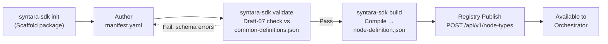
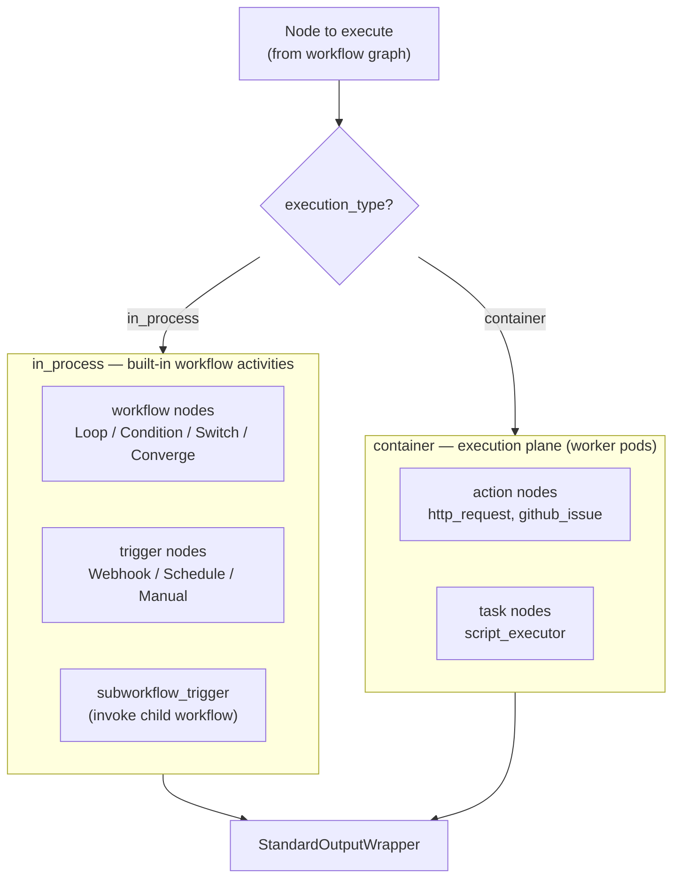
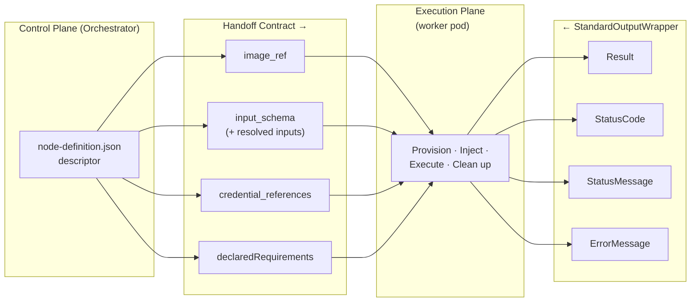
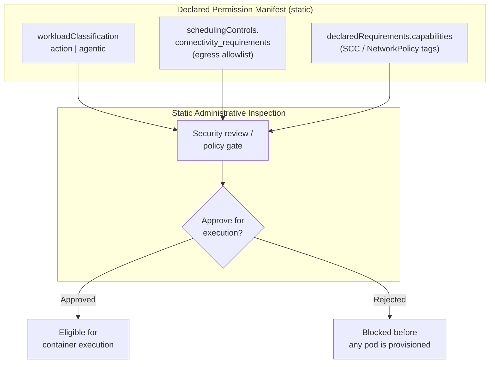

# Syntara Node SDK Architecture

The Syntara Node SDK is a schema-driven framework for authoring, packaging, and registering custom automation nodes. This document defines the node taxonomy, authoring format, registry database schema, REST API contract, and dynamic dispatch logic.

## Architecture Principles

1. **YAML Authoring, JSON Registry.** Developers author `manifest.yaml` (human-friendly, supports comments). The SDK validates against JSON Schema (Draft-07) and compiles to `node-definition.json` for registry storage. The compiled artifact is the single source of truth consumed by the frontend canvas and backend orchestrator, enabling <500ms canvas form rendering.

2. **Four-Category Taxonomy.** Every node declares exactly one of four categories: `action`, `task`, `workflow`, `trigger`. Category, together with `execution_type`, determines routing and validation.

3. **Explicit Execution Plane.** Every node declares an `execution_type` of `in_process` or `container`. This value is the fork point for dynamic dispatch — it decides whether the node runs as a built-in workflow activity or is handed off to an isolated worker pod.

4. **Strict Backwards Compatibility.** `StandardOutputWrapper` (`Result`, `StatusCode`, `StatusMessage`, `ErrorMessage`) is immutable. Template expressions like `${task.Result.stdout}` never break across node versions.

5. **Zero-Trust Resources.** Node definitions store only UUID references to credentials. The orchestrator resolves them at runtime and injects via tmpfs or environment variables. No raw secrets ever appear in a definition.

6. **Manifest-Declared Permissions.** Nodes declare their capabilities and connectivity in the manifest. Administrators can statically inspect and audit these `declaredRequirements` before any container executes.

## Core Architectural Standards & Taxonomy

### Node Category Taxonomy

The platform recognizes exactly four categories, defined canonically as `NodeCategory` in `common-definitions.json`:

```json
"enum": ["action", "task", "workflow", "trigger"]
```

| Category | Purpose | Typical `execution_type` | Examples |
|----------|---------|--------------------------|----------|
| `action` | Domain and external API integrations | `container` | `http_request`, `github_issue` |
| `task` | Atomic compute and script executors | `container` | `script_executor` (Python 3.12, Bash 5.2) |
| `workflow` | In-memory control-plane logic | `in_process` | `condition`, `loop`, `switch` |
| `trigger` | Event entry points | `in_process` | Webhook, Schedule, Manual, `subworkflow_trigger` |

### Execution Type

`NodeExecutionType` (`common-definitions.json`) captures *where* a node runs:

```json
"enum": ["in_process", "container"]
```

- **`in_process`** — executed inline as a built-in workflow activity inside the orchestrator process. Reserved for control-plane `workflow` logic and `trigger` nodes that need no isolated runtime.
- **`container`** — dispatched to an isolated worker pod. Reserved for `action` and `task` nodes that run user or integration code under strict resource and network isolation.

### The `subworkflow_trigger` Node

`subworkflow_trigger` is a dedicated, first-class node type that lets a parent workflow invoke a child workflow as a composable, reusable unit.

- **Category:** `trigger`
- **Execution type:** `in_process`
- **Reference implementation:** [nodes/subworkflow-trigger/](../nodes/subworkflow-trigger/)

It runs in-process: it accepts the **parent workflow context**, an **ingress payload schema** (the parent↔child contract), and the **caller execution ID**, then hands control to the referenced child workflow. It returns a `StandardOutputWrapper` whose `Result` carries the child workflow's terminal output, so downstream parent nodes can reference it via stable template expressions (e.g., `${call_child.Result.summary}`).

### `manifest.yaml` — The Developer Authoring Format

Developers author a single `manifest.yaml` following Kubernetes Custom Resource Definition (CRD) conventions. The manifest is:

- **Human-friendly** — supports comments and multi-line strings
- **K8s-style structure** — uses `apiVersion`, `kind`, `metadata`, and `spec` sections
- **Validated** — checked against JSON Schema (Draft-07) referencing `common-definitions.json`
- **Compiled** — `syntara-sdk build` produces `node-definition.json`, the artifact stored in the registry

The compiled `node-definition.json` — not the source `manifest.yaml` — is what the registry persists and what the canvas loads to render input forms.

**Standard Package Layout:**
```
my-custom-node/
├── manifest.yaml              # Primary authoring manifest (YAML, K8s CRD structure)
├── main.py                    # Imperative execution code (or main.sh for Bash)
├── requirements.txt           # Python dependencies (optional)
├── README.md                  # Node documentation
└── tests/
    └── test_main.py           # Unit tests
```

**Example `manifest.yaml` structure (K8s CRD style):**

```yaml
apiVersion: syntara.io/v1alpha1
kind: NodeType

metadata:
  name: http_request
  displayName: HTTP Request
  version: 1.0.0
  icon: globe
  description: |
    Non-blocking HTTP/HTTPS API orchestrator with credential injection,
    response parsing, and automatic retry logic.
  tags:
    - integration:rest-api
    - network:external
  author: Syntara Team
  license: Apache-2.0

spec:
  category: action
  execution:
    type: container
    image: registry.example.com/nodes/http-request:1.0.0

  declaredRequirements:
    capabilities:
      - network-egress
      - readonly-root-filesystem
      - tmpfs-mount
    platformVersion: ">=3.0.0"

  schedulingControls:
    connectivity_requirements:
      - host: api.github.com
        ports:
          - port: 443
            protocol: TCP

  inputs:
    properties:
      url:
        type: string
        description: Target HTTP/HTTPS URL
      method:
        type: string
        enum: [GET, POST, PUT, DELETE, PATCH]
        default: GET
    required:
      - url
      - method

  outputs:
    allOf:
      - $ref: "../common-definitions.json#/definitions/StandardOutputWrapper"

  resourceRequirements:
    limits:
      cpu: 500m
      memory: 256Mi
    requests:
      cpu: 100m
      memory: 128Mi

  executionTimeout: 60
```

### Diagram 1 — Node Definition Composition (`manifest.yaml`)

Structural breakdown of what a `manifest.yaml` composes.

```mermaid
graph TB
    MANIFEST["manifest.yaml<br/>(K8s CRD structure)"]

    subgraph CRD["CRD Structure"]
        API["apiVersion + kind"]
        META["metadata<br/>• name, displayName<br/>• version, icon<br/>• description, tags"]
        SPEC["spec"]
    end

    subgraph SPEC_CONTENTS["spec section"]
        CAT["category + execution"]
        INPUTS["inputs<br/>• typed properties<br/>• required / enum / pattern"]
        OUTPUTS["outputs<br/>StandardOutputWrapper"]
        REQS["declaredRequirements<br/>• capabilities<br/>• platformVersion"]
        SCHED["schedulingControls<br/>• connectivity_requirements<br/>• affinity_labels"]
    end

    MANIFEST --> API
    MANIFEST --> META
    MANIFEST --> SPEC
    SPEC --> CAT
    SPEC --> INPUTS
    SPEC --> OUTPUTS
    SPEC --> REQS
    SPEC --> SCHED

    OUTPUTS -.->|$ref| CD["common-definitions.json"]
    REQS -.->|$ref| CD
    SCHED -.->|$ref| CD
```



### Diagram 2 — SDK Authoring & Packaging Lifecycle

The developer lifecycle from scaffold to registry handoff.



## Database Schema & Registry API

The registry persists compiled node definitions in PostgreSQL and exposes them through a versioned REST API.

### `node_types` Table (DDL)

```sql
CREATE TABLE node_types (
    id             UUID PRIMARY KEY DEFAULT gen_random_uuid(),
    name           TEXT NOT NULL,
    category       TEXT NOT NULL
                     CHECK (category IN ('action', 'task', 'workflow', 'trigger')),
    execution_type TEXT NOT NULL
                     CHECK (execution_type IN ('in_process', 'container')),
    descriptor     JSONB NOT NULL,          -- compiled node-definition.json
    image_ref      TEXT,                     -- container image (NULL for in_process nodes)
    version        TEXT NOT NULL DEFAULT '1.0.0',
    enabled        BOOLEAN NOT NULL DEFAULT TRUE,
    created_at     TIMESTAMPTZ NOT NULL DEFAULT now(),
    updated_at     TIMESTAMPTZ NOT NULL DEFAULT now(),
    UNIQUE (name, version)
);

-- Container-backed nodes must declare an image; in_process nodes must not.
ALTER TABLE node_types ADD CONSTRAINT node_types_image_ref_by_execution_type
    CHECK (
        (execution_type = 'container'  AND image_ref IS NOT NULL) OR
        (execution_type = 'in_process' AND image_ref IS NULL)
    );

-- GIN index for querying declared capabilities / connectivity inside the descriptor.
CREATE INDEX idx_node_types_descriptor ON node_types USING GIN (descriptor);
CREATE INDEX idx_node_types_category   ON node_types (category);
CREATE INDEX idx_node_types_enabled    ON node_types (enabled);
```

### `NodeTypeDescriptor` (SQLModel / Pydantic)

A single SQLModel class serves as both the database table and the API schema.

```python
from datetime import datetime
from enum import StrEnum
from typing import Any
from uuid import UUID, uuid4

from sqlalchemy import CheckConstraint, UniqueConstraint
from sqlalchemy.dialects.postgresql import JSONB
from sqlmodel import Column, Field, SQLModel


class NodeCategory(StrEnum):
    ACTION = "action"
    TASK = "task"
    WORKFLOW = "workflow"
    TRIGGER = "trigger"


class NodeExecutionType(StrEnum):
    IN_PROCESS = "in_process"
    CONTAINER = "container"


class NodeTypeDescriptor(SQLModel, table=True):
    """Registry record for a single compiled node definition.

    `descriptor` holds the compiled node-definition.json produced by
    `syntara-sdk build`; it is the contract the orchestrator hands to the
    execution plane. `image_ref` is required for container nodes and
    forbidden for in_process nodes (enforced by a table CHECK constraint).
    """

    __tablename__ = "node_types"
    __table_args__ = (
        UniqueConstraint("name", "version", name="uq_node_types_name_version"),
        CheckConstraint(
            "(execution_type = 'container' AND image_ref IS NOT NULL) OR "
            "(execution_type = 'in_process' AND image_ref IS NULL)",
            name="node_types_image_ref_by_execution_type",
        ),
    )

    id: UUID = Field(default_factory=uuid4, primary_key=True)
    name: str = Field(index=True)
    category: NodeCategory = Field(index=True)
    execution_type: NodeExecutionType
    descriptor: dict[str, Any] = Field(sa_column=Column(JSONB, nullable=False))
    image_ref: str | None = Field(default=None)
    version: str = Field(default="1.0.0")
    enabled: bool = Field(default=True, index=True)
    created_at: datetime = Field(default_factory=datetime.utcnow)
    updated_at: datetime = Field(default_factory=datetime.utcnow)
```

### Registry REST API — `/api/v1/node-types`

All responses use a standard envelope. Single-resource responses wrap the record; list responses include pagination metadata.

| Method | Path | Purpose |
|--------|------|---------|
| `POST` | `/api/v1/node-types` | Register (publish) a compiled node definition |
| `GET` | `/api/v1/node-types` | List registered node types (filter by `category`, `execution_type`, `enabled`; `?view=palette` for the visual-builder drawer) |
| `GET` | `/api/v1/node-types/{id}` | Fetch a single node type record (the path also accepts a node `name`, resolving to the latest version) |
| `GET` | `/api/v1/node-types/{id}/descriptor` | Fetch the raw compiled `node-definition.json` (unwrapped) for canvas form rendering |
| `PATCH` | `/api/v1/node-types/{id}` | Update mutable fields (`enabled`, `image_ref`, `descriptor` for a new version) |
| `DELETE` | `/api/v1/node-types/{id}` | Remove a node type from the registry |

**`POST /api/v1/node-types`** — request body:

```json
{
  "name": "script_executor",
  "category": "task",
  "execution_type": "container",
  "image_ref": "registry.example.com/nodes/script-executor:1.0.0",
  "version": "1.0.0",
  "descriptor": { "...": "compiled node-definition.json" }
}
```

Response `201 Created`:

```json
{
  "data": {
    "id": "550e8400-e29b-41d4-a716-446655440000",
    "name": "script_executor",
    "category": "task",
    "execution_type": "container",
    "image_ref": "registry.example.com/nodes/script-executor:1.0.0",
    "version": "1.0.0",
    "enabled": true,
    "descriptor": { "...": "compiled node-definition.json" },
    "created_at": "2026-09-09T12:00:00Z",
    "updated_at": "2026-09-09T12:00:00Z"
  }
}
```

**`GET /api/v1/node-types?category=task&enabled=true`** — list envelope:

```json
{
  "data": [
    { "id": "550e8400-...", "name": "script_executor", "category": "task", "execution_type": "container", "enabled": true }
  ],
  "meta": { "total": 1, "limit": 50, "offset": 0 }
}
```

#### Visual-builder views

**`GET /api/v1/node-types?view=palette`** — the drag-and-drop node drawer summary:

```json
{
  "data": [
    {
      "name": "http_request",
      "displayName": "HTTP Request",
      "category": "action",
      "executionType": "container",
      "version": "1.0.0",
      "description": "Non-blocking HTTP/HTTPS API orchestrator with credential injection, response parsing, and automatic retry logic.",
      "icon": "globe"
    }
  ],
  "meta": { "total": 1, "limit": 50, "offset": 0 }
}
```

**`GET /api/v1/node-types/{id}/descriptor`** — returns the compiled `node-definition.json` **verbatim and unwrapped**. The canvas renders input forms, default values, field groupings, and port bindings directly from this document.

A reference implementation of these endpoints lives in [`syntara/schemas/nodes/http-request/test_postgres_registry.py`](../nodes/http-request/test_postgres_registry.py).

## Dynamic Dispatch Logic

The orchestrator's workflow engine forks execution on a node's `execution_type`. This fork is the boundary between the control plane and the execution plane.



- **`in_process` branch** — the engine dispatches the node as a built-in workflow activity within the orchestrator process. This path serves control-plane `workflow` logic and `trigger` nodes.
- **`container` branch** — the engine resolves credentials and connectivity, then hands the node's descriptor to the execution plane, which provisions an isolated worker pod.

Both branches return the identical `StandardOutputWrapper` envelope, so downstream nodes are agnostic to where a node ran.

### Diagram 3 — Execution Plane Handoff Contract

The contract the control plane hands to the execution plane for a `container` node.



## Policy & Security Enforcement

### The Three-Party Enforcement Model

1. **The node declares what it needs.** Every requirement is stated declaratively in `manifest.yaml`: `credential_references`, `schedulingControls` (`connectivity_requirements`, `affinity_labels`), `declaredRequirements.capabilities`, `resourceRequirements`. Nothing a node needs at runtime may be acquired implicitly.

2. **The environment declares what it permits.** Each deployment environment has its own policy: which capability tags are grantable, which egress destinations are reachable, which credential classes are available, and which resource ceilings apply.

3. **The Execution Plane enforces isolation at runtime.** The execution plane consumes the intersection of (1) and (2) and compiles it into concrete runtime controls — Kubernetes **NetworkPolicies**, **Security Context Constraints**, tmpfs credential mounts, and resource limits.

### Diagram 4 — Declared Capabilities & Permission Manifest

Static administrative inspection before any container runs.



Key inspection points, all resolvable without executing the node:

- **`workloadClassification`** (`action` | `agentic`) — gates which credential classes the node may access; `agentic` nodes are blocked from infrastructure credentials
- **`connectivity_requirements`** — the declared egress allowlist, from which the orchestrator compiles a restrictive NetworkPolicy
- **`declaredRequirements.capabilities`** — SCC / NetworkPolicy tags (e.g., `network-egress`, `script-execution`) validated against cluster policy

### Credential Handling

**No plaintext secrets, ever.** No raw API key, password, token, or secret material is stored in a node definition (`manifest.yaml` or the compiled `node-definition.json`). Nodes reference credentials exclusively through abstract UUID references (`CredentialReference`). At dispatch time the execution plane resolves the `credential_id`, decrypts the vault entry, and injects it directly into worker-pod memory / tmpfs. File mounts are RAM-backed and deleted on container exit.

**Security classification (`workloadClassification`):**

- **`action`** — scripted, deterministic execution. May request infrastructure credentials (SSH, cloud API keys, vault access).
- **`agentic`** — LLM-driven, non-deterministic execution. **Restricted from requesting high-privilege infrastructure credentials.** This prevents a prompt-injection attack against an AI agent node from escalating into infrastructure compromise.

## Schema Reference

### Platform Meta-Schema

The platform maintains a **single meta-schema** that defines shared types, enums, and validation rules:

| File | Role |
|------|------|
| `common-definitions.json` | **Sole platform meta-schema** — defines `NodeTypeManifest`, `NodeCategory`, `NodeExecutionType`, `WorkloadClassification`, `StandardOutputWrapper`, `CredentialReference`, `ResourceRequirements`, `SchedulingControls`, and `DependencyDeclaration` |

Individual node schemas are **not** maintained as separate `.schema.json` files. Instead:

1. **Developers author** `manifest.yaml` instances following the K8s CRD structure
2. **The SDK compiles** each manifest into a `node-definition.json` build artifact via `syntara-sdk build`
3. **The registry persists** the compiled `node-definition.json` in the `node_types.descriptor` JSONB column
4. **The orchestrator and canvas consume** the compiled artifact, not the source manifest

`common-definitions.json` is the authoritative source for shared platform types. All `manifest.yaml` instances reference these definitions via `$ref` during validation.

### Key Common Definitions

| Definition | Purpose | Shape |
|---|---|---|
| `NodeTypeManifest` | K8s CRD structure validation | `{apiVersion, kind, metadata, spec}` |
| `NodeCategory` | Four-category taxonomy | `enum: ["action", "task", "workflow", "trigger"]` |
| `NodeExecutionType` | Execution plane fork | `enum: ["in_process", "container"]` |
| `WorkloadClassification` | Credential access control | `enum: ["action", "agentic"]` |
| `StandardOutputWrapper` | Immutable output contract | `{Result, StatusCode, StatusMessage, ErrorMessage}` |
| `CredentialReference` | UUID-based credential reference | `{credential_id, credential_mount_type, credential_mount_path}` |
| `ResourceRequirements` | Kubernetes resource limits | `{limits: {cpu, memory}, requests: {cpu, memory}}` |
| `SchedulingControls` | Egress allowlist + affinity | `{connectivity_requirements, affinity_labels}` |

### Compiled Definition Shape (K8s CRD)

Every compiled `node-definition.json` follows the K8s CRD structure:

```json
{
  "apiVersion": "ao.redhat.com/v1alpha1",
  "kind": "NodeType",
  "metadata": {
    "name": "http_request",
    "displayName": "HTTP Request",
    "version": "1.0.0",
    "icon": "globe",
    "description": "...",
    "tags": ["integration:rest-api", "network:external"]
  },
  "spec": {
    "category": "action",
    "execution": {
      "type": "container",
      "image": "registry.example.com/nodes/http-request:1.0.0"
    },
    "inputs": { "...": "typed properties" },
    "outputs": { "$ref": "common-definitions.json#/definitions/StandardOutputWrapper" }
  }
}
```

## Example Nodes

The SDK includes reference implementations demonstrating each node category:

| Example | Category | Execution Type | Location |
|---------|----------|----------------|----------|
| `http_request` | action | container | [syntara/schemas/nodes/http-request/](../nodes/http-request/) |
| `script_executor` | task | container | [syntara/schemas/nodes/script-executor/](../nodes/script-executor/) |
| `subworkflow_trigger` | trigger | in_process | [syntara/schemas/nodes/subworkflow-trigger/](../nodes/subworkflow-trigger/) |

Each example includes:
- Complete `manifest.yaml` following K8s CRD structure
- Compiled `node-definition.json` artifact
- Test suite demonstrating validation and registration
- README with usage instructions

## Getting Started

### Prerequisites

- Python 3.12+
- PostgreSQL 15+ (for registry storage)
- Kubernetes/OpenShift cluster (for container node execution)

### Installation

```bash
pip install syntara-node-sdk
```

### Create Your First Node

```bash
# Scaffold a new node package
syntara-sdk init my-custom-node --category action

# Edit the generated manifest.yaml
cd my-custom-node
vim manifest.yaml

# Validate against the platform meta-schema
syntara-sdk validate

# Compile to node-definition.json
syntara-sdk build

# Publish to the registry
syntara-sdk publish --registry-url https://registry.example.com
```

### Running the Examples

```bash
# Run the http_request example test suite
cd nodes/http-request
uv run test_postgres_registry.py
```

## License

Apache License 2.0. See [LICENSE](../LICENSE) for details.
