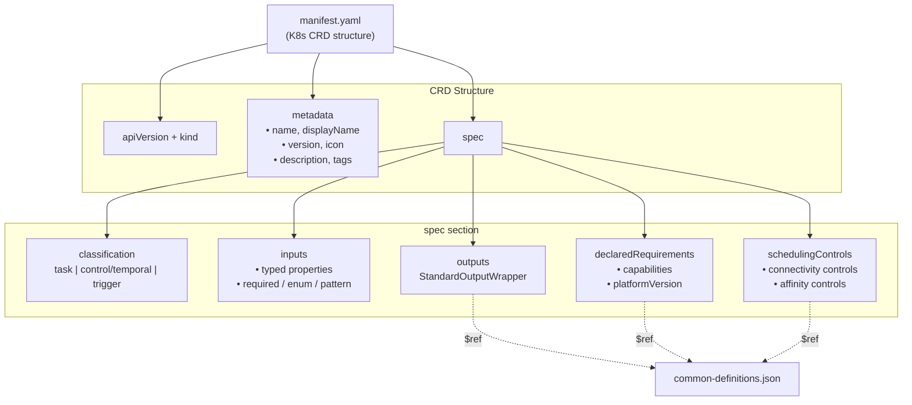
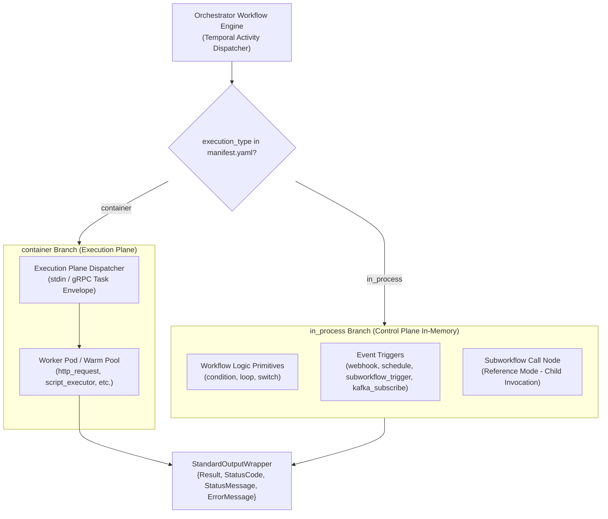
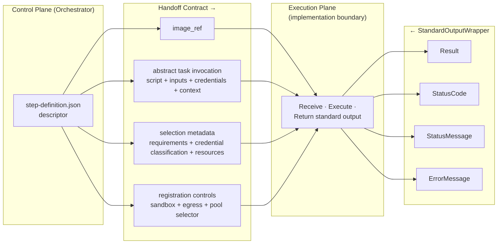
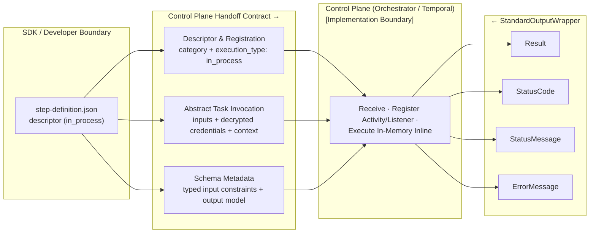
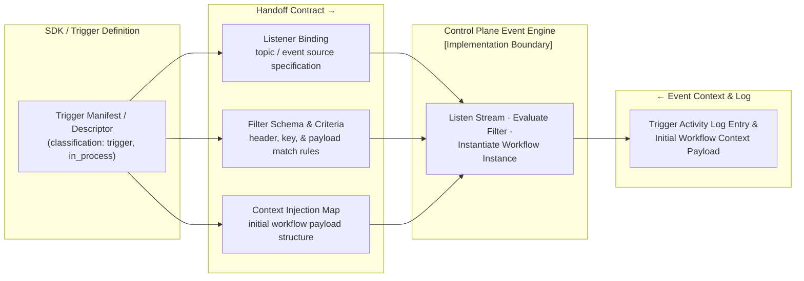
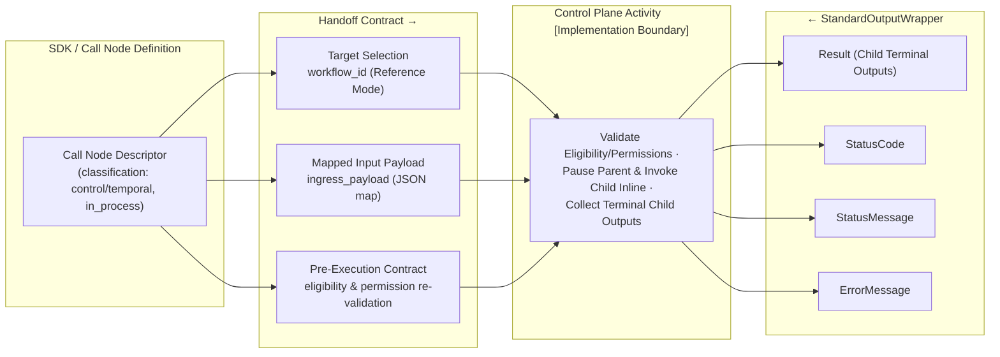
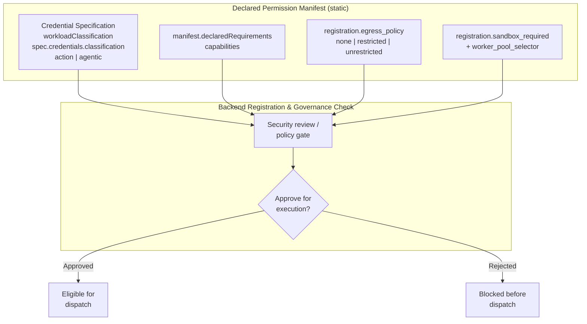

# Syntara Step SDK Architecture

The Syntara Step SDK is a schema-driven framework for authoring, packaging, and registering custom automation steps. This document defines the step taxonomy, authoring format, platform integration assumptions, and execution placement delegation.

## Architecture Principles and Boundaries

The following principles are normative for the SDK-owned contracts. The SDK owns schemas, manifests, compiled descriptors, declared requirements, registration metadata, and the abstract task-invocation payload. The SDK and execution-plane design jointly determine the service transport's required message semantics and compatibility constraints. The execution plane owns worker lifecycle, provisioning backends, pool image selection, runtime credential injection, transport adapter implementation, sandbox enforcement, retries, persistence, scrubbing implementation, and completion delivery. Later sections provide implementation details and examples without redefining these boundaries.

1. **YAML authoring, JSON registry, OCI distribution.** Developers author `manifest.yaml` in a human-friendly format with comments. The SDK validates it against JSON Schema Draft-07 and compiles the descriptor that is embedded in the step's OCI artifact. The OCI artifact is the versioned, published, and stored distribution unit for every step type.

2. **Step classification taxonomy.** Every step declares exactly one classification (`task`, `action`, `workflow`, `trigger`) within the overall platform taxonomy. Step definitions declare functional contracts (input/output schemas, abstract dependencies) similar to Ansible modules.

3. **Execution placement delegation and abstract task payload.** Step definitions declare functional contracts, while the Execution Plane (EP) determines runtime execution placement based on step classification, resource requirements, and administrative policies or mediators. Both the SDK and execution-plane design jointly determine the service transport's required message semantics and compatibility constraints; the execution plane implements the transport adapter, injection, lifecycle, retries, persistence, and completion behavior.

4. **Universal OCI packaging and coupled metadata.** Fully decoupling metadata is rejected because independently versioned metadata can drift from the packaged step artifact. Every step is built, versioned, published, and stored as an OCI container image artifact. Every artifact carries its manifest descriptor as an OCI-compliant referral layer annotation with media type `application/vnd.syntara.step.manifest.v1+yaml`. Registration performs an OCI Distribution API manifest or digest metadata query, inspects the response metadata in `<10 ms`, and does not download image layers. The platform's indexed metadata store consumes the extracted manifest and makes the descriptor, inputs, outputs, and image reference available to the canvas in `<500 ms` without an edit-time OCI request. Supports vanilla OCI registry compatibility (standard Kubernetes, EKS, AKS, Quay) without proprietary registry dependencies.

5. **Selection metadata is part of the SDK-to-plane handoff.** `declaredRequirements`, `schedulingControls`, `credentialSpecification.workloadClassification`, resource requirements, and execution timeout describe what the step needs so the platform can validate and route it. These fields express step needs; they do not define worker lifecycle or runtime enforcement mechanics.

6. **Secret handling has an ordered SDK handoff lifecycle.** Draft-07 input properties must use `secret: true` for sensitive values; `is_secret: true` is the compatibility alias. The SDK-side order is `classify → split → decrypt → construct invocation`: secret-marked values are removed from plain `inputs`, decrypted into the transient `credentials` map, and included in the abstract task invocation. The same schema flags remain available to the execution plane for credential separation and its logging and persistence guarantees.

7. **Requirements and controls have different owners.** Developer manifests may declare requested capabilities in `spec.declaredRequirements` (for example, `capabilities: [network-egress]`). Syntara administrators set the effective infrastructure controls during registration through `sandbox_required`, `egress_policy`, and `worker_pool_selector`; these settings are not hardcoded in developer metadata. The platform registration contract carries those fields so pools can be provisioned automatically or assigned manually without changing the SDK contract.

8. **OCI registration authority follows every step description.** The OCI container image artifact and its referral-layer manifest are authoritative for every step classification. A descriptor change requires publishing and registering a new image tag or digest; the universal OCI packaging eliminates separate file, ZIP, or direct-descriptor distribution paths.

9. **Strict backwards compatibility.** `StandardOutputWrapper` (`Result`, `StatusCode`, `StatusMessage`, `ErrorMessage`) is immutable. Template expressions like `${task.Result}` never break across step versions.

10. **Zero-trust resources.** Node definitions store only UUID references to platform-managed credentials. Runtime secret handling and the persistence/logging guarantee are execution-plane responsibilities, while the SDK preserves the credential-reference and sensitive-input contracts described above and in **Credential Handling**.

11. **Node-side validation before execution.** The Python reference base classes validate an invocation against the declared input model before calling step execution logic. Execution-plane validation remains an independent boundary check for transport, authorization, and policy enforcement; step code must not be invoked when step-side validation fails.

## Reference SDK Contract (Phase 1)

The Phase 1 Python reference SDK establishes the language-neutral concepts that other SDK implementations must preserve:

- **`StepType`** represents the manifest-backed step identity, classification, version, and descriptor metadata.
- **`ActionStep`** and **`TaskStep`** specialize the base step execution contract for domain/API integrations and atomic compute, respectively. `WorkflowStep` and `TriggerStep` provide the corresponding control/temporal and trigger classifications.
- **`Input`** and **`Output`** represent the typed schemas used to validate invocation data and describe step results. In the Python implementation these are supplied by the typed input/output models accepted by `BaseNode`.
- **`Credential`** represents a platform-managed credential reference and its permitted runtime presentation; plaintext credential material is not part of a step definition.
- **`ExecutionContext`** carries the workflow execution context supplied to step logic without coupling the step to a particular worker or transport implementation.

The reference hierarchy is an SDK contract, not a requirement that every language use Python class names. All implementations must preserve manifest compatibility, pre-execution input validation, credential-reference semantics, and the standard output envelope.

### Node-Side Input Validation

Before a step's `run` or equivalent execution method is invoked, its base class validates the raw invocation against the declared input model. Invalid, incomplete, or schema-incompatible data produces the standard error result and prevents extension logic from running. This check is intended to reject malformed or malicious payloads early; the execution plane remains responsible for its own transport, authorization, policy, and boundary validation.

The validation ownership is intentionally layered. Node-side validation protects the extension process from invalid data, while execution-plane validation protects the platform boundary. A future transport adapter must not remove either check.

### Dynamic Resource Pickers

Dynamic resource pickers are a secondary capability for forms that need to query an external endpoint at configuration time, such as an AAP inventory or SCM playbook selector. The static manifest schema remains authoritative for field identity, type, requiredness, defaults, and validation. Picker results may supply values or choices, but they must not become an implicit dependency for loading the step descriptor or make the canvas perform remote OCI discovery while editing.

## Core Architectural Standards & Taxonomy

### Step Classification Taxonomy

The platform recognizes step classifications within the overall platform taxonomy, defined canonically as `StepClassification` in `common-definitions.json`:

```json
"enum": ["action", "task", "workflow", "trigger"]
```

| Category | Purpose | Typical `execution_type` | Examples |
|----------|---------|--------------------------|----------|
| `action` | Domain and external API integrations | `container` | `http_request`, `github_issue` |
| `task` | Atomic compute and script executors | `container` | `script_executor` (Python 3.12, Bash 5.2) |
| `workflow` | In-memory control-plane logic and composition | `in_process` | `condition`, `loop`, `switch`, `subworkflow_call` |
| `trigger` | Event entry points | `in_process` | Webhook, Schedule, Kafka Subscribe, Manual, `subworkflow_trigger` |

All classifications use the same universal OCI container image packaging boundary for catalog management, versioning, registration, and marketplace discovery. Metadata indexing via referral-layer annotations (`application/vnd.syntara.step.manifest.v1+yaml`) supports <10ms OCI queries and <500ms UI canvas rendering without pulling image layers. Subworkflow composition uses native Temporal child workflow executions within the Control Plane.

### Universal OCI Packaging and Execution Placement Delegation

#### Packaging Boundary (Universal OCI Container Images)

All step classifications use universal OCI container image packaging. The artifact and its
`application/vnd.syntara.step.manifest.v1+yaml` referral layer provide the
versioned catalog unit for registration, database indexing, and marketplace
discovery. The platform can query the OCI digest metadata in `<10 ms`, hydrate
its local index, and render canvas forms in `<500 ms` without pulling image
layers during editing. Supports vanilla OCI registry compatibility (standard Kubernetes, EKS, AKS, Quay) without proprietary registry dependencies.

#### Runtime Execution Placement Delegation

Step definitions declare functional contracts (input/output schemas, abstract dependencies) similar to Ansible modules. The Execution Plane (EP) determines runtime execution placement based on step classification, resource requirements, and administrative policies or mediators, without requiring explicit execution-type fields in step manifests. The platform evaluates:

- **Step classification** — `task`, `control/temporal`, or `trigger` classification informs execution characteristics
- **Resource requirements** — CPU, memory, and timeout declarations
- **Administrative policies** — Sandbox requirements, network egress policies, and worker pool selectors configured during registration
- **Mediators** — Platform-defined execution mediators that can override default placement logic

This delegation model allows the Execution Plane to optimize placement without coupling step definitions to specific execution infrastructure.

##### The `subworkflow_trigger` Step (Child Entry & Eligibility)

- **Classification:** `trigger`
- **Reference implementation:** [tests/fixtures/steps/subworkflow_trigger/](../tests/fixtures/steps/subworkflow_trigger/)

This is the dedicated child-side entry trigger for Reference-mode subworkflow invocation by a parent workflow. It defines the child workflow's required input-variable schema and output contract. A workflow is eligible for Reference-mode invocation only when it contains an active `subworkflow_trigger`.

##### The Subworkflow Call Step (Parent Invoker & Composition)

- **Classification:** `workflow`
- **Reference implementation:** [tests/fixtures/steps/subworkflow_call/](../tests/fixtures/steps/subworkflow_call/)

This is the parent-side caller step. It selects a target child workflow by `workflow_id`, dynamically surfaces the child's required input variables as configurable form fields, re-validates child eligibility and the user's execute permission at runtime, pauses parent execution while invoking the child synchronously, and maps the child's terminal output into `StandardOutputWrapper.Result` for downstream template access (for example, `${call_child.Result.summary}`).

### `manifest.yaml` — The Developer Authoring Format

Developers author a single `manifest.yaml` following Kubernetes Custom Resource Definition (CRD) conventions. The manifest is:

- **Human-friendly** — supports comments and multi-line strings
- **K8s-style structure** — uses `apiVersion`, `kind`, `metadata`, and `spec` sections
- **Validated** — checked against JSON Schema (Draft-07) referencing `common-definitions.json`
- **Compiled** — the manifest produces `step-definition.json`, embedded in the OCI artifact stored in the registry

Every step manifest remains coupled to its OCI artifact through the referral
layer. The canvas consumes the platform's indexed metadata record rather than
fetching remote metadata while an editor is open.

The manifest and compiled descriptor define the step contract; the universal OCI container image artifact carries the versioned step distribution. `spec.execution.image` identifies the OCI image artifact for all step classifications. The language-neutral SDK contract applies to the invocation and result boundary, while the Execution Plane determines runtime execution placement based on step classification, resource requirements, and administrative policies.

**Plugin Structure & Multi-Step Packaging:**

A single plugin package can house one or more step type definitions (`StepType` descriptors) across different classifications. For example, a plugin could contain both a trigger and a task in the same package. UI canvas grouping (tags, labels) categorizes tools independently of backend plugin packaging layouts, allowing flexible organization of related steps.

**Standard Package Layout:**
```
my-custom-step/
├── manifest.yaml              # Primary authoring manifest (YAML, K8s CRD structure)
├── main.py                    # Imperative execution code (or main.sh for Bash)
├── requirements.txt           # Python dependencies (optional)
├── README.md                  # Step documentation
└── tests/
    └── test_main.py           # Unit tests
```

**Example `manifest.yaml` structure (K8s CRD style):**

The base manifest includes `spec.declaredRequirements`. Extension authors use it to declare requested capabilities, credential types, and minimum platform version. These declarations are inputs to administrative review; they do not themselves grant sandbox, network, or worker-pool access.

**Note (Non-Normative Example):** Payload and manifest examples in this section are provided strictly for illustrative purposes. They do not define or reference implementation-specific API endpoints.

```yaml
apiVersion: syntara.io/v1alpha1
kind: StepType

metadata:
  name: http_request
  displayName: HTTP Request
  version: 1.0.0
  icon: globe
  description: |
    Non-blocking HTTP/HTTPS API orchestrator with credential injection,
    response parsing, and automatic retry logic.
  tags:
    - integration:rest-api
    - network:external
  author: Syntara Team
  license: Apache-2.0

spec:
  classification: task
  execution:
    image: registry.example.com/steps/http-request:1.0.0

  declaredRequirements:
    capabilities:
      - network-egress
      - readonly-root-filesystem
      - tmpfs-mount
    platformVersion: ">=3.0.0"

  schedulingControls:
    # Optional developer-declared controls. Effective sandbox, egress, and
    # worker-pool policy is supplied by administrators at registration.
    connectivity_requirements:
      - host: api.github.com
        ports:
          - port: 443
            protocol: TCP

  inputs:
    properties:
      url:
        type: string
        description: Target HTTP/HTTPS URL
      api_key:
        type: string
        description: Runtime API key; classified as sensitive by the schema
        secret: true
      method:
        type: string
        enum: [GET, POST, PUT, DELETE, PATCH]
        default: GET
    required:
      - url
      - method

  outputs:
    allOf:
      - $ref: "../common-definitions.json#/definitions/StandardOutputWrapper"

  resourceRequirements:
    limits:
      cpu: 500m
      memory: 256Mi
    requests:
      cpu: 100m
      memory: 128Mi

  executionTimeout: 60
```

### Diagram 1 — Step Definition Composition (`manifest.yaml`)

Structural breakdown of what a `manifest.yaml` composes.


```mermaid
graph TB
    MANIFEST["manifest.yaml<br/>(K8s CRD structure)"]

    subgraph CRD["CRD Structure"]
        API["apiVersion + kind"]
        META["metadata<br/>• name, displayName<br/>• version, icon<br/>• description, tags"]
        SPEC["spec"]
    end

    subgraph SPEC_CONTENTS["spec section"]
        CLASS["classification<br/>task | control/temporal | trigger"]
        INPUTS["inputs<br/>• typed properties<br/>• required / enum / pattern"]
        OUTPUTS["outputs<br/>StandardOutputWrapper"]
        REQS["declaredRequirements<br/>• capabilities<br/>• platformVersion"]
        SCHED["schedulingControls<br/>• connectivity controls<br/>• affinity controls"]
    end

    MANIFEST --> API
    MANIFEST --> META
    MANIFEST --> SPEC
    SPEC --> CLASS
    SPEC --> INPUTS
    SPEC --> OUTPUTS
    SPEC --> REQS
    SPEC --> SCHED

    OUTPUTS -.->|$ref| CD["common-definitions.json"]
    REQS -.->|$ref| CD
    SCHED -.->|$ref| CD
```

### Diagram 2 — SDK Authoring & Packaging Lifecycle

The developer lifecycle from scaffold to registry handoff.


```mermaid
graph LR
    INIT["syntara-sdk init<br/>(Scaffold package)"]
    AUTHOR["Author<br/>manifest.yaml"]
    VALIDATE["syntara-sdk validate<br/>Draft-07 check vs<br/>common-definitions.json"]
    BUILD["Build OCI artifact<br/>manifest + implementation"]
    REFERRAL["Attach referral layer<br/>application/vnd.syntara.step.manifest.v1+yaml"]
    PUBLISH["Publish/version OCI artifact<br/>platform registration"]
    HANDOFF["Indexed in platform DB<br/>available to Orchestrator"]

    INIT --> AUTHOR
    AUTHOR --> VALIDATE
    VALIDATE -->|Pass| BUILD
    VALIDATE -.->|Fail: schema errors| AUTHOR
    BUILD --> REFERRAL --> PUBLISH
    PUBLISH --> HANDOFF
```

## Platform Metadata & Storage Assumptions

The SDK does not prescribe a database schema, ORM, persistence technology, or
REST routing model for the host platform. It assumes that extension
registration populates an indexed platform metadata store that can support the
following uses:

- retain the compiled `step-definition.json` descriptor or an equivalent canonical representation extracted from each step's OCI referral layer;
- expose indexed identity, category, version, execution type, and image-reference metadata;
- make input and output schemas available to the canvas and execution plane;
- keep administrative registration policy separate from developer-authored manifests and OCI metadata; and
- satisfy the `<500 ms` canvas discovery and rendering SLA without remote OCI calls during editing.

The metadata store may be implemented with a relational database, document
store, search index, cache, or another platform-owned service. Its schema and
storage transport are implementation choices outside the SDK specification.

The concrete wire protocol remains an open joint SDK and execution-plane decision. The SDK specification owns the invocation and result semantics and the compatibility requirements that any selected protocol must satisfy; the execution plane owns the adapter implementation and runtime consumption.

### Illustrative platform registry consumption

The following conceptual projection shows the information a platform registry
could parse from a compiled descriptor. It is an illustrative example only and
is not a final implementation record, ORM model, storage schema, or API
contract.

**Note (Non-Normative Example):** Payload and manifest examples in this section are provided strictly for illustrative purposes. They do not define or reference implementation-specific API endpoints.

```json
{
  "identity": {
    "name": "script_executor",
    "version": "1.0.0"
  },
  "metadata": {
    "displayName": "Python Script Executor",
    "category": "task",
    "description": "Executes a script in a shared runner"
  },
  "descriptor": "compiled step-definition.json",
  "execution": {
    "type": "container",
    "image": "quay.io/syntara/script-python-executor:latest"
  },
  "availability": {
    "enabled": true
  }
}
```

An implementation may map this projection to an ORM model or other indexed
record, but that mapping is non-normative. The SDK contract is the manifest,
compiled descriptor, OCI packaging convention, and execution handoff—not the
platform's persistence representation.

### Authoritative registration paths by step type

All step categories use the same OCI registration path. Runtime execution type
changes dispatch behavior only; it does not change how a step is packaged,
versioned, published, or indexed:

| Node type | Authoritative registration mechanism | Image and descriptor rules |
|-----------|--------------------------------------|----------------------------|
| All `action`, `task`, `workflow`, and `trigger` steps | OCI Distribution API digest query | The OCI artifact and its `application/vnd.syntara.step.manifest.v1+yaml` referral layer are authoritative. A descriptor change requires registering a new image tag or digest, regardless of `execution_type`. |

For every step, `image_ref` identifies the artifact whose metadata is inspected.
The platform performs the OCI metadata query in `<10 ms`, extracts the embedded
manifest annotation, and hydrates its indexed metadata store without downloading
image layers. Re-registering a new image version or digest is the supported
descriptor-update path and prevents image/metadata version drift. Administrative
fields such as `sandbox_required`, `egress_policy`, and `worker_pool_selector`
remain registration-owned for every step type.

**Note (Non-Normative Example):** Payload and manifest examples in this section are provided strictly for illustrative purposes. They do not define or reference implementation-specific API endpoints.

```json
{
  "name": "script_executor",
  "category": "task",
  "execution_type": "container",
  "image_ref": "registry.example.com/steps/script-executor:1.0.0",
  "version": "1.0.0",
  "sandbox_required": true,
  "egress_policy": "restricted",
  "worker_pool_selector": {
    "workload": "automation",
    "region": "us-east-1"
  }
}
```

The platform may validate administrative policy fields and may expose indexed
descriptor and palette projections to the canvas through any suitable local
discovery mechanism. Those choices are intentionally outside this SDK
specification.

## Dynamic Dispatch Logic

The orchestrator's workflow engine forks execution on a step's `execution_type`. This fork is the boundary between the control plane and the execution plane.

### Execution Placement Dispatch


```mermaid
graph TB
    GRAPH["Orchestrator Workflow Engine<br />(Temporal Activity Dispatcher)"]
    FORK{"execution_type in manifest.yaml?"}

    subgraph INPROC_BOX["in_process Branch (Control Plane In-Memory)"]
        direction TB
        CTRL["Workflow Logic Primitives<br />(condition, loop, switch)"]
        TRIG_NODE["Event Triggers<br />(webhook, schedule, subworkflow_trigger, kafka_subscribe)"]
        SUBWF_CALL["Subworkflow Call Node<br />(Reference Mode - Child Invocation)"]
    end

    subgraph CONTAINER_BOX["container Branch (Execution Plane)"]
        direction TB
        EXEC_DISPATCH["Execution Plane Dispatcher<br />(stdin / gRPC Task Envelope)"]
        WORKER_POD["Worker Pod / Warm Pool<br />(http_request, script_executor, etc.)"]
    end

    RESULT["StandardOutputWrapper<br />{Result, StatusCode, StatusMessage, ErrorMessage}"]

    GRAPH --> FORK
    FORK -->|in_process| INPROC_BOX
    FORK -->|container| CONTAINER_BOX

    INPROC_BOX --> RESULT
    EXEC_DISPATCH --> WORKER_POD --> RESULT
```

- **`in_process` branch** — the engine dispatches the SDK-authored step implementation as a built-in workflow activity within the orchestrator process. This path serves control-plane workflow logic, event triggers, and reference-mode subworkflow calls; those implementations execute in the orchestrator rather than being sent to the execution plane.
- **`container` branch** — the engine resolves the local descriptor and registration policy, performs the ordered classify/split/decrypt/invocation-construction flow, and hands the execution plane the abstract task invocation plus the step-specific selection metadata. The execution plane consumes that handoff and returns the standard output contract; worker lifecycle, provisioning backend, transport, retries, persistence, and completion delivery are outside the SDK.

Both branches return the identical `StandardOutputWrapper` envelope, so downstream steps are agnostic to where a step ran.

### Diagram 3 — SDK-to-Execution-Plane Handoff Contract

The contract the control plane hands to the execution plane for a `container` step.


```mermaid
graph LR
    subgraph CONTROL["Control Plane (Orchestrator)"]
        DESC["step-definition.json<br/>descriptor"]
    end

    subgraph CONTRACT["Handoff Contract →"]
        C1["image_ref"]
        C2["abstract task invocation<br/>script + inputs + credentials + context"]
    C3["selection metadata<br/>requirements + credential classification + resources"]
        C4["registration controls<br/>sandbox + egress + pool selector"]
    end

    subgraph PLANE["Execution Plane<br/>(implementation boundary)"]
        BB["Receive · Execute ·<br/>Return standard output"]
    end

    subgraph RETURN["← StandardOutputWrapper"]
        R1["Result"]
        R2["StatusCode"]
        R3["StatusMessage"]
        R4["ErrorMessage"]
    end

    DESC --> C1 --> BB
    DESC --> C2 --> BB
    DESC --> C3 --> BB
    DESC --> C4 --> BB
    BB --> R1
    BB --> R2
    BB --> R3
    BB --> R4
```

The handoff fields have distinct purposes:

- **`image_ref`** identifies the registered OCI artifact for every step type; its referral-layer descriptor remains authoritative regardless of whether `execution_type` routes the step `in_process` or to a container worker.
- **The abstract task invocation** carries the script, plain inputs, decrypted credentials, and workflow context required to execute the step without exposing secret-marked values in the plain `inputs` map. Its concrete transport is selected through the joint SDK and execution-plane protocol decision and implemented by the execution plane.
- **Selection metadata** carries the step's declared requirements, `credentialSpecification.workloadClassification`, resource shape, and timeout so the platform can validate and route the invocation.
- **Registration controls** carry the administrator's authoritative sandbox, egress, and worker-pool binding independently of developer-authored metadata.

## Control-Plane (`in_process`) Sequence Flows

The `in_process` diagrams intentionally stop at the SDK-to-Control-Plane
handoff. The Control Plane (Temporal Orchestrator) is shown as an implementation
boundary: the SDK defines the descriptor, schemas, invocation metadata, and
standard result contract, while the Control Plane registers activities or
listeners and performs the internal execution. These paths do not create an
execution-plane task or worker pod for each event.

### General `in_process` SDK Handoff Contract

Every in-process step uses the same SDK-facing handoff shape. The descriptor
identifies the step category and execution placement; schema metadata describes
the typed inputs and output model; and the abstract invocation carries the
runtime values and context. The Control Plane owns how those fields are
registered and executed inline and returns the immutable result envelope.


```mermaid
graph LR
    subgraph SDK["SDK / Developer Boundary"]
        DESC["step-definition.json<br />descriptor (in_process)"]
    end

    subgraph CONTRACT["Control Plane Handoff Contract →"]
        C1["Descriptor & Registration<br />category + execution_type: in_process"]
        C2["Abstract Task Invocation<br />inputs + decrypted credentials + context"]
        C3["Schema Metadata<br />typed input constraints + output model"]
    end

    subgraph ENGINE["Control Plane (Orchestrator / Temporal)<br />[Implementation Boundary]"]
        BB["Receive · Register Activity/Listener ·<br />Execute In-Memory Inline"]
    end

    subgraph RETURN["← StandardOutputWrapper"]
        R1["Result"]
        R2["StatusCode"]
        R3["StatusMessage"]
        R4["ErrorMessage"]
    end

    DESC --> C1 --> BB
    DESC --> C2 --> BB
    DESC --> C3 --> BB
    BB --> R1
    BB --> R2
    BB --> R3
    BB --> R4
```

### Event Trigger SDK Handoff Contract

Event triggers, including Kafka Subscribe and the child-side
`subworkflow_trigger`, expose event-source binding, filter, and initial-context
metadata through the SDK descriptor. The Control Plane owns the listener,
filter evaluation, workflow instantiation, and trigger activity logging. For a
`subworkflow_trigger`, the descriptor also establishes the child's
Reference-mode eligibility; it is not the parent-side caller.


```mermaid
graph LR
    subgraph SDK["SDK / Trigger Definition"]
        TRIG_DESC["Trigger Manifest / Descriptor<br />(classification: trigger, in_process)"]
    end

    subgraph HANDOFF["Handoff Contract →"]
        H1["Listener Binding<br />topic / event source specification"]
        H2["Filter Schema & Criteria<br />header, key, & payload match rules"]
        H3["Context Injection Map<br />initial workflow payload structure"]
    end

    subgraph CONTROL["Control Plane Event Engine<br />[Implementation Boundary]"]
        EXEC["Listen Stream · Evaluate Filter ·<br />Instantiate Workflow Instance"]
    end

    subgraph RETURN["← Event Context & Log"]
        OUT["Trigger Activity Log Entry &<br />Initial Workflow Context Payload"]
    end

    TRIG_DESC --> H1 --> EXEC
    TRIG_DESC --> H2 --> EXEC
    TRIG_DESC --> H3 --> EXEC
    EXEC --> OUT
```

### Synchronous Composition SDK Handoff Contract

The `subworkflow_call` descriptor is the parent-side SDK contract for
Reference-mode composition. It exposes the target identifier, the mapped wire
payload, and the pre-execution contract that the platform must evaluate. The
Control Plane owns child selection, eligibility and permission checks, parent
pausing, child execution, and terminal-output collection; the SDK owns the
descriptor and the stable result shape. The child-side `subworkflow_trigger`
descriptor remains the source of the child's required input schema and
Reference-mode eligibility.


```mermaid
graph LR
    subgraph SDK["SDK / Call Node Definition"]
        CALL_DESC["Call Node Descriptor<br />(classification: control/temporal, in_process)"]
    end

    subgraph HANDOFF["Handoff Contract →"]
        H1["Target Selection<br />workflow_id (Reference Mode)"]
        H2["Mapped Input Payload<br />ingress_payload (JSON map)"]
        H3["Pre-Execution Contract<br />eligibility & permission re-validation"]
    end

    subgraph CONTROL["Control Plane Activity<br />[Implementation Boundary]"]
        EXEC["Validate Eligibility/Permissions ·<br />Pause Parent & Invoke Child Inline ·<br />Collect Terminal Child Outputs"]
    end

    subgraph RETURN["← StandardOutputWrapper"]
        R1["Result (Child Terminal Outputs)"]
        R2["StatusCode"]
        R3["StatusMessage"]
        R4["ErrorMessage"]
    end

    CALL_DESC --> H1 --> EXEC
    CALL_DESC --> H2 --> EXEC
    CALL_DESC --> H3 --> EXEC
    EXEC --> R1
    EXEC --> R2
    EXEC --> R3
    EXEC --> R4
```

## Policy & Security Enforcement

### The Three-Party Enforcement Model

1. **The step declares its contract and requirements.** `manifest.yaml` declares the step's category, execution metadata (including an image reference when `execution_type: container`), input/output schemas, secret markers, resource shape, `credentialSpecification`, and `declaredRequirements`. For example, `credentialSpecification.workloadClassification: agentic` establishes the credential access boundary, while `declaredRequirements.capabilities: [network-egress]` states that the extension needs outbound connectivity. Sensitive input definitions must use `secret: true` (or `is_secret: true`). The manifest declares the need; it does not grant infrastructure access.

2. **Administrators set registration policy.** Syntara supplies `sandbox_required`, `egress_policy`, and `worker_pool_selector` through the platform registration contract. These settings are authoritative for the registered extension and remain independent of the image metadata. The platform may provision pools automatically or use an operations assignment.

3. **The Execution Plane consumes the SDK contract.** It receives the local descriptor, abstract task invocation, declared requirements, and administrative registration controls. It owns worker lifecycle, provisioning, runtime credential injection, sandbox and transport enforcement, retries, persistence, log scrubbing, and completion delivery. Those mechanisms are intentionally not defined by the SDK.

### Diagram 4 — Declared Capabilities & Permission Manifest

Diagram 4 represents static **Platform Registration & Governance Inspection** performed by the backend during step registration and dispatch preparation. It is a policy and metadata flow; it is not code executed inside the SDK runtime. The step manifest supplies requirements and credential classification, while the platform evaluates those declarations against administrator-controlled registration policy before allowing dispatch.


```mermaid
graph TB
    subgraph MANIFEST["Declared Permission Manifest (static)"]
        WC["Credential Specification<br/>workloadClassification<br/>spec.credentials.classification<br/>action | agentic"]
        REQS["manifest.declaredRequirements<br/>capabilities"]
        CONN["registration.egress_policy<br/>none | restricted | unrestricted"]
        CAPS["registration.sandbox_required<br/>+ worker_pool_selector"]
    end

    subgraph AUDIT["Backend Registration & Governance Check"]
        REVIEW["Security review /<br/>policy gate"]
        DECISION{"Approve for<br/>execution?"}
    end

    WC --> REVIEW
    REQS --> REVIEW
    CONN --> REVIEW
    CAPS --> REVIEW
    REVIEW --> DECISION
    DECISION -->|Approved| ALLOW["Eligible for<br/>dispatch"]
    DECISION -->|Rejected| BLOCK["Blocked before<br/>dispatch"]
```

Key inspection points, all resolvable without executing the step:

- **Credential Specification classification** (`action` | `agentic`) — `workloadClassification` is defined inside the step's credential specification in the step's manifest (`spec.credentials.classification` in the platform permission model; stored by the SDK descriptor as `spec.credentialSpecification.workloadClassification`). It gates which credential classes the step may access; `agentic` steps are blocked from infrastructure credentials.
- **`egress_policy`** — the administrator-selected egress mode supplied to the execution plane for runtime policy enforcement
- **`sandbox_required`** — the administrative requirement supplied to the execution plane for sandbox enforcement
- **`worker_pool_selector`** — affinity labels supplied to the execution plane for eligible worker selection

### Credential Handling

Secret handling has the following required order:

1. **Classify.** Before execution-plane dispatch and before the abstract invocation is constructed, the dispatcher validates the logical invocation against the compiled input schema. A property is sensitive when it has the canonical `secret: true` flag; the compatibility alias `is_secret: true` is also recognized.
2. **Split.** The dispatcher uses those schema flags to separate the invocation values into plain `inputs` and secret-marked values. Secret values are not copied into the plain `inputs` map.
3. **Decrypt.** The credential service resolves and decrypts the secret-marked values, producing the transient `credentials` map. A decryption or authorization failure stops dispatch before the execution plane receives the invocation.
4. **Construct the abstract invocation.** The dispatcher builds the invocation envelope containing the script code, plain `inputs`, decrypted `credentials`, and `workflow_context`:

   **Note (Non-Normative Example):** Payload and manifest examples in this section are provided strictly for illustrative purposes. They do not define or reference implementation-specific API endpoints.

   ```json
   {
     "script": "...",
     "inputs": {"url": "https://example.com"},
     "credentials": {"api_key": "..."},
     "workflow_context": {"execution_id": "..."}
   }
   ```

5. **Hand off the abstract invocation.** The complete envelope—including decrypted `credentials`—is the SDK-to-execution-plane task payload. The execution plane implements the selected transport adapter, credential-injection mechanism, and mapping to the step runner.
6. **Retain schema sensitivity metadata for the execution plane.** The compiled `secret: true`/`is_secret: true` definitions accompany the step contract so the execution plane can separate credentials and apply its logging and persistence guarantees. The SDK does not define the scrubbing implementation.

The step process does not implement a technology-specific execution-plane entry point. Its SDK-facing contract is to consume the abstract invocation and return the standard output contract through the protocol selected by the joint SDK and execution-plane design; the execution plane owns transport adaptation and completion signaling.

**Security classification (`credentialSpecification.workloadClassification`):**

- **`action`** — scripted, deterministic execution. May request infrastructure credentials (SSH, cloud API keys, vault access).
- **`agentic`** — LLM-driven, non-deterministic execution. **Restricted from requesting high-privilege infrastructure credentials.** This prevents a prompt-injection attack against an AI agent step from escalating into infrastructure compromise.

## Schema Reference

### Platform Meta-Schema

The platform maintains a **single meta-schema** that defines shared types, enums, and validation rules:

| File | Role |
|------|------|
| `common-definitions.json` | **Sole platform meta-schema** — defines `NodeTypeManifest`, `StepClassification`, `NodeExecutionType`, `CredentialSpecification`, `WorkloadClassification`, `StandardOutputWrapper`, `CredentialReference`, `InputParameter`, `ResourceRequirements`, `SchedulingControls`, and `DependencyDeclaration` |

Individual step schemas are **not** maintained as separate `.schema.json` files. Instead:

1. **Developers author** `manifest.yaml` instances following the K8s CRD structure
2. **The SDK compiles** each manifest into a `step-definition.json` build artifact for backend DB storage
3. **The platform metadata store persists** the compiled `step-definition.json` or an equivalent canonical descriptor
4. **The orchestrator and canvas consume** the compiled artifact, not the source manifest

`common-definitions.json` is the authoritative source for shared platform types. All `manifest.yaml` instances reference these definitions via `$ref` during validation.

### Key Common Definitions

| Definition | Purpose | Shape |
|---|---|---|
| `NodeTypeManifest` | K8s CRD structure validation | `{apiVersion, kind, metadata, spec}` |
| `StepClassification` | Four-category taxonomy | `enum: ["action", "task", "workflow", "trigger"]` |
| `NodeExecutionType` | Execution plane fork | `enum: ["in_process", "container"]` |
| `CredentialSpecification` | Node credential access boundary | `{workloadClassification, credential_references}` |
| `WorkloadClassification` | Credential access classification | `enum: ["action", "agentic"]` |
| `StandardOutputWrapper` | Immutable output contract | `{Result, StatusCode, StatusMessage, ErrorMessage}` |
| `CredentialReference` | UUID-based credential reference | `{credential_id, credential_mount_type, credential_mount_path}` |
| `InputParameter` | Sensitive-input classification | `secret: true` or `is_secret: true` |
| `NodeRegistrationPolicy` | Syntara-owned execution policy | `{sandbox_required, egress_policy, worker_pool_selector}` |
| `ResourceRequirements` | Kubernetes resource limits | `{limits: {cpu, memory}, requests: {cpu, memory}}` |
| `SchedulingControls` | Developer-declared scheduling controls | `{connectivity_requirements, affinity_labels}` |

### Compiled Definition Shape (K8s CRD)

Every compiled `step-definition.json` follows the K8s CRD structure:

**Note (Non-Normative Example):** Payload and manifest examples in this section are provided strictly for illustrative purposes. They do not define or reference implementation-specific API endpoints.

```json
{
  "apiVersion": "syntara.io/v1alpha1",
  "kind": "StepType",
  "metadata": {
    "name": "http_request",
    "displayName": "HTTP Request",
    "version": "1.0.0",
    "icon": "globe",
    "description": "...",
    "tags": ["integration:rest-api", "network:external"]
  },
  "spec": {
    "category": "action",
    "execution": {
      "type": "container",
      "image": "registry.example.com/steps/http-request:1.0.0"
    },
    "inputs": { "...": "typed properties" },
    "outputs": { "$ref": "common-definitions.json#/definitions/StandardOutputWrapper" }
  }
}
```

## Example Nodes

The SDK includes reference implementations demonstrating each step category:

| Example | Classification | Execution Type | Location | Purpose |
|---------|----------|----------------|----------|---------|
| `http_request` | action | container | [tests/fixtures/steps/http_request/](../tests/fixtures/steps/http_request/) | External API integration |
| `script_executor` | task | container | [tests/fixtures/steps/script_executor/](../tests/fixtures/steps/script_executor/) | Zero-build script runner |
| `subworkflow_call` | workflow | in_process | [tests/fixtures/steps/subworkflow_call/](../tests/fixtures/steps/subworkflow_call/) | Parent-side child workflow invoker |
| `subworkflow_trigger` | trigger | in_process | [tests/fixtures/steps/subworkflow_trigger/](../tests/fixtures/steps/subworkflow_trigger/) | Child-side entry & eligibility trigger |

Each example documents:
- A complete `manifest.yaml` following K8s CRD structure
- The descriptor fields used for registration and canvas metadata
- A README with the step's contract and execution boundary

Where an example has executable SDK code, its test suite demonstrates
validation and registration. Platform-owned in-process composition steps may
provide a descriptor and contract reference without a local runner.
